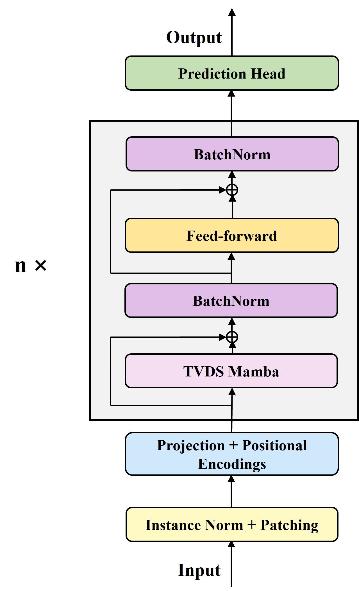
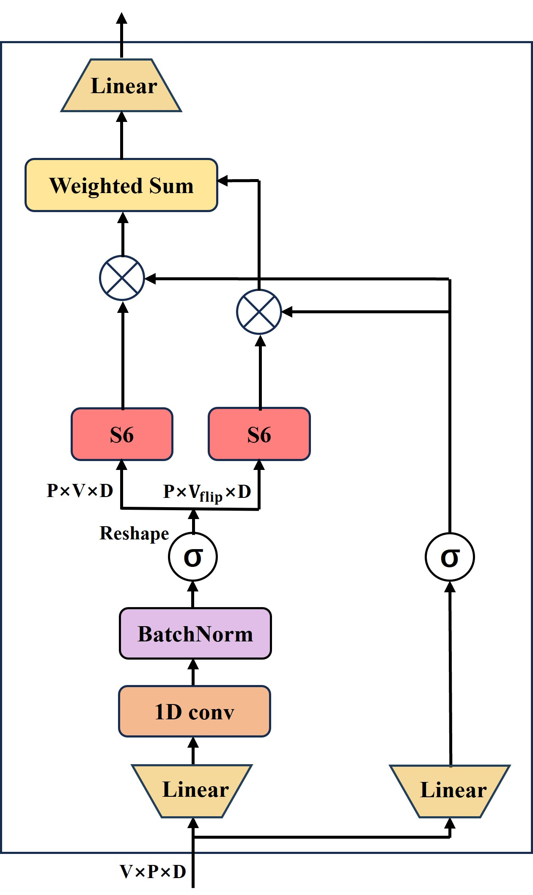

# DEMamba

This is an official implementation of paper:https://openreview.net/attachment?id=rBMsxZa1w5&name=pdf.


## Overall Architecture

The architecture of DEMamba. (a) The multivariate time series data is segmented into patches, which are then embedded into patch tokens. These patch tokens are fed into $n$ layers of encoder to capture temporal, cross-variate, and feature dependencies. (b) The TVDS Mamba block captures temporal dependencies with 1D convolution. The data is then reshaped and two S6 modules are utilized to capture cross-variate dependencies in both forward and backward directions, due to the non-causal nature of the variable dimension. (c) In the original Mamba block, 1D convolution and S6 module capture dependencies along the same dimension of the data.

<p align="center">

</p>

<p align="center">

</p>

<p align="center">

</p>

## Usage 

1. Install Pytorch and the necessary dependencies.

```
pip install -r requirements.txt
```

1. The datasets can be obtained from [Google Drive](https://drive.google.com/file/d/1l51QsKvQPcqILT3DwfjCgx8Dsg2rpjot/view?usp=drive_link) or [Baidu Cloud](https://pan.baidu.com/s/11AWXg1Z6UwjHzmto4hesAA?pwd=9qjr).

2. Train and evaluate the model. We provide all the above tasks under the folder ./scripts/. You can reproduce the results as the following examples:

```
bash ./scripts/Traffic/DEMamba.sh
```

## Citation

If you find this repo helpful, please cite our paper. 

```
```

## Acknowledgement

We appreciate the following GitHub repos a lot for their valuable code and efforts.
- iTransformer ([https://github.com/lucidrains/reformer-pytorch](https://github.com/thuml/iTransformer))
- PatchTsT (https://github.com/PatchTST/PatchTST)
- Time-Series-Library (https://github.com/thuml/Time-Series-Library)


## Contact

If you have any questions or want to use the code, feel free to contact:
* Yang Liu (ly267212826@163.com)
* Junluo Zheng (zhengjl688@163.com)
* Jianyong Chen (jychen@szu.edu.cn)
